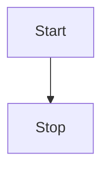
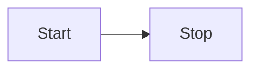
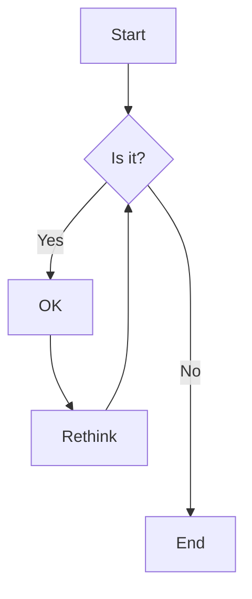

<!-- Above is Pandoc metadata in YAML front-matter https://docs.github.com/en/contributing/writing-for-github-docs/using-yaml-frontmatter - this is NOT standard markdown! -->

- [yet another markdown cheat sheet](#yet-another-markdown-cheat-sheet)
  * [Example Markdown Syntax](#example-markdown-syntax)
    + [Bullet List](#bullet-list)
    + [Numbered Bullet List](#numbered-bullet-list)
    + [Nested Lists](#nested-lists)
      - [Code Blocks](#code-blocks)
  * [HTML](#html)
    + [Heading](#heading)
  * [GFM](#gfm)
  * [Tables in Markdown](#tables-in-markdown)
    + [Table GFM](#table-gfm)
    + [Table Google Code Wiki](#table-google-code-wiki)
    + [Raw HTML Table](#raw-html-table)

<small><i><a href='http://ecotrust-canada.github.io/markdown-toc/'>Table of contents generated with markdown-toc</a></i></small>


# yet another markdown cheat sheet


Convert this readme into html using Pandoc:

    pandoc -o README.html --from=gfm README.md
    pandoc -w html5 -o README.html --from=gfm README.md
    # NOTE1 --standalone will include some syntax highlighting support
    # NOTE2 --standalone and -w html5 will wrap lines rather than take entire page width
    # NOTE3 --standalone and -w html5 will auto expand all collapse blocks
    pandoc --standalone --metadata title="yet another markdown cheat sheet" -w html5 -o README.html --from=gfm README.md
    pandoc --standalone -w html5 -o README.html --from=gfm README.md

----------------------------------------

Recommend using `#` for headers, easier to grep. But can use "underlines" with `-` and `=`.

Example Markdown Syntax
-----------------------


Markdown is well documented at:

  * <http://daringfireball.net/projects/markdown/basics>
  * <http://daringfireball.net/projects/markdown/syntax>

Table of contents can be handled; manually, with a plugin in the output generator, with tools that inject into the Markdown file itself https://ecotrust-canada.github.io/markdown-toc/

### Bullet List

Un-numbered bullet lists start with a star character "*" followed by a space. I recommend starting the indentation at 2 spaces. Bullet items across multiple lines should be indented to match, I recommend the 2nd line (etc.) be indented 4 spaces to match the previous line text start.

  * one
  * two, this is a long example showing how to wrap very very very
    very long lines.
  * three

The above was generated with:

      * one
      * two, this is a long example showing how to wrap very very very
        very long lines.
      * three

### Numbered Bullet List

Numbered bullet lists start with a number and a period. I recommend starting the indentation at 1 space.

 1. one
 2. two, this is a long example showing how to wrap very very very
    very long lines.
 3. three

The above was generated with:

     1. one
     2. two
     3. three

A custom filter is in place to convert "1)" into "1.", etc. but it is recommended that regular markdown syntax be used.

### Nested Lists

Nested lists start with the same indentation level as a regular list, nested levels are indented the same amount again.

 1. one
 2. two, this is a long example showing how to wrap very very very
    very long lines. Also some nested bullets:
      * this is nested
      * this too
 3. three
      * and finally more nested bullets

The above was generated with:

     1. one
     2. two, this is a long example showing how to wrap very very very
        very long lines. Also some nested bullets:
          * this is nested
          * this too
     3. three
          * and finally more nested bullets

#### Code Blocks

Code blocks are useful for scripts, i.e. blocks of code :-) but also error text. Code blocks should be indented with 4 spaces for basic markdown implementation or triple-backticks. Use a decent text editor to change indentation (Scite, Notepad2, gvim, etc.).

Here is some SQL:

Indented

    /* ---- file: workaround.sql ---- */
    drop table some_table;
    /* ---- cut here ---- */

Triple backticks with a hint for syntax highlighting

```sql
/* ---- file: workaround.sql ---- */
drop table some_table;
/* ---- cut here ---- */
```

------------------------------------------------------------------------

## HTML

You can embed HTML, some generators will honor (original spec), some might filter it.


<details>
<summary>Click me to expand</summary>

### Heading

You can add text, images, or code blocks within a collapsed section
```python
print("Hello, World!")
```
</details>


<details open>
<summary>Click me to collapse</summary>
This section is expanded by default
</details>

----------------


## Tables in Markdown

### Table GFM

Github Flavored Markdown

NOTE actual doc link as of 2024-03-12 16:48  is https://docs.github.com/en/get-started/writing-on-github/working-with-advanced-formatting/organizing-information-with-tables

Markdown2 docs https://github.com/trentm/python-markdown2/wiki/tables

Sample input (and/or workaround if plugin not available)

    | First Header  | Second Header |
    | ------------- | ------------- |
    | Content Cell  | Content Cell  |
    | Content Cell  | Content Cell  |


| First Header  | Second Header |
| ------------- | ------------- |
| Content Cell  | Content Cell  |
| Content Cell  | Content Cell  |

NOTE this will generate a table with regular html table tags:
  * thead
      * th
  * tbody
      * tr

Another demo with different alignment:

    | Left-aligned | Center-aligned | Right-aligned |
    | :---         |     :---:      |          ---: |
    | git status   | git status     | git status    |
    | git diff     | git diff       | git diff      |

| Left-aligned | Center-aligned | Right-aligned |
| :---         |     :---:      |          ---: |
| git status   | git status     | git status    |
| git diff     | git diff       | git diff      |

NOTE uses `style="text-align:left;"`


How to include the pipe character via escape:

    | Name     | Character |
    | ---      | ---       |
    | Backtick | `         |
    | Pipe     | \|        |

| Name     | Character |
| ---      | ---       |
| Backtick | `         |
| Pipe     | \|        |


### Table Google Code Wiki

Google Code no longer exists! This demo may not work for most (extended) Markdown implementations.

Markdown2 docs https://github.com/trentm/python-markdown2/wiki/wiki-tables

Basically double pipe and no table header line indicator

    || First Header  || Second Header ||
    || Content Cell  || Content Cell  ||
    || Content Cell  || Content Cell  ||

|| First Header  || Second Header ||
|| Content Cell  || Content Cell  ||
|| Content Cell  || Content Cell  ||

NOTE this will generate a table with body and row html table tags:
  * tbody
      * tr

I.e. missing:
  * thead
      * th


Another demo with different alignment:


|| Left-aligned || Center-aligned || Right-aligned ||
|| git status   || git status     || git status    ||
|| git diff     || git diff       || git diff      ||

How to include the pipe character, no need for escape :-):

|| Name     || Character ||
|| Backtick || `         ||
|| Pipe     || |        ||

### Raw HTML Table


<table>
<thead>
<tr>
<th>First Header</th>
<th>Second Header</th>
</tr>
</thead>
<tbody>
<tr>
<td>Content Cell</td>
<td>Content Cell</td>
</tr>
<tr>
<td>Content Cell</td>
<td>Content Cell</td>
</tr>
</tbody>
</table>

generated from:

```html
<table>
<thead>
<tr>
<th>First Header</th>
<th>Second Header</th>
</tr>
</thead>
<tbody>
<tr>
<td>Content Cell</td>
<td>Content Cell</td>
</tr>
<tr>
<td>Content Cell</td>
<td>Content Cell</td>
</tr>
</tbody>
</table>
```

-------------

## Syntax Demos

### test Python code

```python
print(1)
print("1")
```

### Mermaid Flowchart

Note Pandoc supports Mermaid only via filters, e.g. https://github.com/clach04/pandoc-mermaid-filter/releases/tag/20250521

https://mermaid.js.org/syntax/flowchart.html







-----------

## GFM

Github Flavored Markdown

GFM supports tables (as does Google Code Wiki Markdown - https://github.com/trentm/python-markdown2/wiki/wiki-tables) https://github.com/trentm/python-markdown2/wiki/tables see earlier.

If tables are to be used (see if you can avoid them) I recommend GFM tables.

Some tools handle this out of box (like Pandoc), others need a plugin (like https://github.com/trentm/python-markdown2/wiki/Extras)

https://github.com/ikatyang/emoji-cheat-sheet

## Other Samples

See:

  * https://github.com/clach04/sample_reading_media
